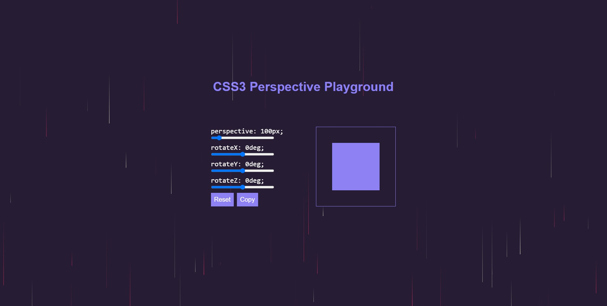

## Overview

A small project I built as part of the Complete Vue Mastery 2021 (w/ Vuex, Composition API, Router) course by zerotomastery.io

### Screenshot

### Links

- Live Site URL: [Hosted on Netlify](https://perspectiveplayground.netlify.app/)

### Built with

- Semantic HTML5 markup
- CSS custom properties
- Flexbox
- [Vue3](https://v3.vuejs.org/) - JS library

## Author

- Website - [Tiago Costa](https://www.tiagocostadev.com/#/)